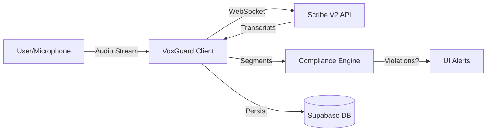

# VoxGuard AI 🛡️


**VoxGuard AI** is an advanced **real-time voice security and compliance monitoring system**. It leverages **ElevenLabs Scribe V2** and **Supabase** to transcribe calls instantly, detect regulatory violations (SEC, GDPR, HIPAA), and protect sensitive data in real-time.

Designed for call centers, financial institutions, and support teams where compliance is non-negotiable.

---

## 🚀 Key Features

### 🎙️ Real-time Transcription Engine

- **Scribe V2 Integration**: Powered by ElevenLabs' latest low-latency speech-to-text model.
- **AudioWorklet Architecture**: Modern, non-blocking audio processing for glitch-free streaming.
- **Smart Resilience**: Auto-reconnection with exponential backoff and connection state management.
- **Advanced Audio Processing**: Built-in echo cancellation, noise suppression, and auto-gain control.

### 🛡️ Intelligent Compliance Core

- **Instant Violation Detection**: Checks every speech segment against 19+ regulatory rules (SEC, FINRA, PCI-DSS) in <10ms.
- **Regex & Keyword Matching**: Powerful pattern matching engine for complex rule definitions.
- **Severity Levels**: Granular alerting system (Critical 🚨, High ⚠️, Medium ⚡, Low ℹ️).
- **Visual Feedback**:
  - **Toast Notifications**: Immediate alerts for operators.
  - **Inline Highlighting**: Transcript segments turn Red/Yellow based on risk.
  - **Badges**: Clear visual markers for violations.

### 🧠 Advanced Analysis

- **Sentiment Analysis**: Real-time emotion detection (Positive 😊, Neutral 😐, Negative 😟).
- **Language Detection**: Automatic language identification with confidence scores.
- **Profanity Masking**: Auto-masking of inappropriate language for professional environments.
- **Custom Vocabulary**: Enhanced recognition for specific compliance terms (e.g., "GDPR", "HIPAA").

### 📊 Comprehensive Dashboard

- **Live Monitoring**: Watch transcripts and alerts flow in real-time.
- **Risk Scoring**: Automated risk assessment for every call.
- **Audit Trails**: Full history of transcripts, alerts, and metadata stored securely in Supabase.
- **Waveform Visualization**: Interactive audio visualization during recording.

---

## 🏗️ Architecture



---

## 🛠️ Technology Stack

- **Frontend**: [Next.js 15](https://nextjs.org/) (App Router), [React 19](https://react.dev/)
- **Styling**: [Tailwind CSS 4](https://tailwindcss.com/), [Lucide React](https://lucide.dev/) (Icons)
- **Backend & DB**: [Supabase](https://supabase.com/) (PostgreSQL, Realtime, Auth)
- **AI / ML**: [ElevenLabs Scribe V2](https://elevenlabs.io/) (Speech-to-Text)
- **Audio**: Web Audio API (AudioWorklet), WaveSurfer

---

## 🚦 Getting Started

### Prerequisites

- Node.js 20+
- NPM or Yarn
- A [Supabase](https://supabase.com/) project
- An [ElevenLabs](https://elevenlabs.io/) API Key

### Installation

1.  **Clone the repository**

    ```bash
    git clone https://github.com/diassique/voxguard-ai.git
    cd voxguard-ai
    ```

2.  **Install dependencies**

    ```bash
    npm install
    ```

3.  **Environment Setup**
    Create a `.env.local` file in the root directory:

    ```env
    NEXT_PUBLIC_SUPABASE_URL=your_supabase_url
    NEXT_PUBLIC_SUPABASE_ANON_KEY=your_supabase_anon_key
    ELEVENLABS_API_KEY=your_elevenlabs_api_key
    ```

4.  **Database Migration**
    Run the SQL scripts provided in `supabase/` or `COMPLIANCE_SETUP.md` in your Supabase SQL Editor to set up the necessary tables (`call_transcripts`, `compliance_rules`, `compliance_alerts`).

5.  **Run Development Server**
    ```bash
    npm run dev
    ```
    Open [http://localhost:3000](http://localhost:3000) to view the app.

---

## 📚 Documentation

Detailed documentation for specific modules:

- [**Compliance Setup**](COMPLIANCE_SETUP.md): Guide to setting up rules, regex patterns, and database schemas.
- [**Real-time Compliance**](REALTIME_COMPLIANCE.md): Deep dive into the real-time detection logic.
- [**WebSocket Architecture**](PRODUCTION_READY.md): Technical details on the AudioWorklet and robust WebSocket implementation.
- [**Scribe V2 Features**](SCRIBE_V2_ENHANCEMENTS.md): Overview of new API features like sentiment analysis and automatic language detection.

---

## 🛡️ Compliance Rules (Out-of-the-Box)

VoxGuard comes pre-configured with rules for:

- **SEC/FINRA**: Insider trading, market manipulation, promissory statements.
- **GDPR/PII**: Credit card numbers, social security numbers, sensitive personal data.
- **Conduct**: Harassment, threats, profanity.

---

## 🤝 Contributing

Contributions are welcome! Please examine the `CONTRIBUTING.md` (if available) or submit a Pull Request.

1.  Fork the Project
2.  Create your Feature Branch (`git checkout -b feature/AmazingFeature`)
3.  Commit your Changes (`git commit -m 'Add some AmazingFeature'`)
4.  Push to the Branch (`git push origin feature/AmazingFeature`)
5.  Open a Pull Request

---

## 📄 License

Distributed under the MIT License. See `LICENSE` for more information.
